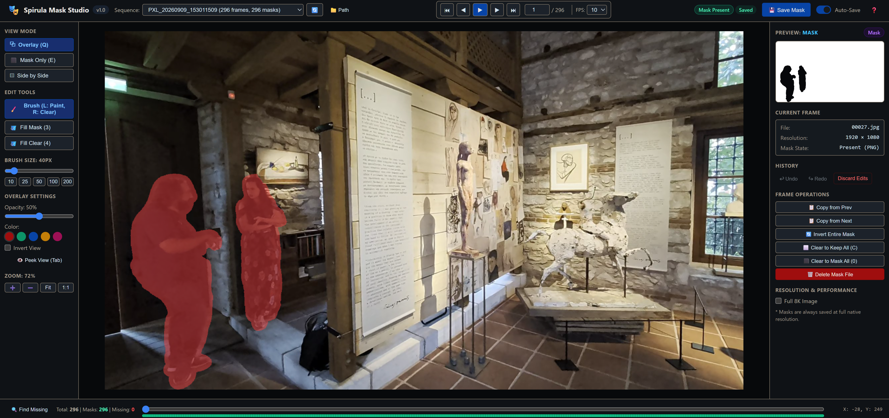

# 🎭 Spirula Mask Studio

[](https://www.python.org/downloads/)
[](https://fastapi.tiangolo.com)
[](https://www.docker.com/)
[](LICENSE)

**Spirula Mask Studio** is a fast, interactive web-based mask editor specifically designed for video frame sequences, camera rigs, NeRF, and 3D Gaussian Splatting (3DGS) datasets. It provides a fluid, responsive workflow for inspecting, drawing, and cleaning up binary segmentation masks across thousands of high-resolution (up to 8K) frames.

---

## 📸 Interface Preview



---

## ✨ Key Features

- **⚡ High-Performance Preview Caching**:
  - Instant scrubbing and playback across large image sequences with on-the-fly preview generation using Pillow draft-scaling.
  - Full-resolution (native 8K) inspection toggle on demand.
  - Masks are **always saved at full native resolution** without quality degradation.

- **🖌️ Dual-Action Brush & Paint Tools**:
  - **Left Click**: Paint exclusion mask (`0` / Masked Out / Tinted).
  - **Right Click**: Erase exclusion mask (`255` / Keep / Included).
  - **Dynamic Radius**: Adjustable brush size (2px–400px) with quick presets and a temporary half-radius precision modifier (`Hold R`).
  - **Flood Fill Tools**: One-click fill operations for masked areas (`3`) and cleared areas (`4`).
  - **Full Undo / Redo**: Multi-step history buffer (`Ctrl+Z`, `Ctrl+Y`) for confident editing.

- **👁️ Versatile View Modes**:
  - **Overlay View (`Q`)**: Blend mask over the RGB frame with configurable tint color (Red, Green, Blue, Amber, Pink) and opacity slider.
  - **Mask Only View (`E`)**: Inspect the pure binary mask (black and white).
  - **Side-by-Side View (`O`)**: Split-screen comparing raw RGB frames side-by-side with the binary mask or colored overlay.
  - **Peek Modes**:
    - Hold `Tab` to quickly peek between Overlay and Mask views.
    - Hold `Shift+Tab` to instantly peek at the clean, unfiltered raw RGB frame.
  - **Interactive Alt-Preview (Picture-in-Picture)**: Live miniature preview card showing the alternate mode; click anytime to swap.

- **🎞️ Sequence & Timeline Management**:
  - **Scrubber Bar**: Visual timeline indicator with frame status overview (Total, Masked, Missing).
  - **"Find Missing"**: One-click jump to the next unmasked frame in the sequence.
  - **Slideshow Playback**: Play/pause through frames at configurable frame rates (5 to 30 FPS).
  - **Inter-Frame Operations**:
    - Copy mask from the previous (`Copy from Prev`) or next (`Copy from Next`) frame.
    - Forward and backward mask propagation.
    - Clear to Keep All (`255`), Clear to Mask All (`0`), or Invert Entire Mask.

- **📁 Intuitive Dataset Browser**:
  - Built-in file chooser modal with directory breadcrumbs, parent navigation, and quick shortcuts.
  - Automatic detection of valid dataset folders containing `images/` and `masks/`.
  - Session state persistence (automatically restores last opened directory, sequence, and frame).
  - Built-in safe deletion with `.trash` archiving.

---

## 📂 Dataset Structure

Spirula Mask Studio expects datasets to follow standard multi-view / video sequence conventions:

```text
dataset_root/
├── images/
│   ├── sequence_01/
│   │   ├── 00001.jpg
│   │   ├── 00002.jpg
│   │   └── ...
│   └── sequence_02/
│       ├── frame_0001.png
│       └── ...
└── masks/
    ├── sequence_01/
    │   ├── 00001.png
    │   └── ...
    └── sequence_02/
        └── ...
```

> **Note on Mask Format**:
> - Masks are 8-bit single-channel grayscale PNGs (or RGBA).
> - **`255` (White)**: Keep / Valid region.
> - **`0` (Black)**: Masked out / Excluded region.

Multi-dataset parent directories (e.g. `/datasets/scene_a/images/...` and `/datasets/scene_b/images/...`) are also automatically recognized.

---

## ⌨️ Keyboard Shortcuts

| Shortcut | Action |
| :--- | :--- |
| <kbd>Left</kbd> / <kbd>A</kbd> | Previous frame |
| <kbd>Right</kbd> / <kbd>D</kbd> | Next frame |
| <kbd>Space</kbd> | Play / Pause playback (or Pan when dragging) |
| <kbd>Left Click</kbd> | Paint Mask (`0`, Exclude / Tint) |
| <kbd>Right Click</kbd> | Clear Mask (`255`, Keep) |
| <kbd>3</kbd> | Fill Mask tool (`0`) |
| <kbd>4</kbd> | Fill Clear Mask tool (`255`) |
| <kbd>R</kbd> *(Hold)* | Half brush radius for precision detailing |
| <kbd>[</kbd> / <kbd>]</kbd> | Decrease / Increase brush size |
| <kbd>Q</kbd> | Switch to **Overlay** view mode |
| <kbd>E</kbd> | Switch to **Mask Only** view mode |
| <kbd>O</kbd> | Toggle **Side-by-Side** split view |
| <kbd>Tab</kbd> *(Hold)* | Peek alternate view (Overlay ↔ Mask) |
| <kbd>Shift</kbd> + <kbd>Tab</kbd> *(Hold)* | Peek clean raw RGB image |
| <kbd>Mouse Wheel</kbd> | Zoom in / out at cursor position |
| <kbd>Space</kbd> + <kbd>Drag</kbd> | Pan viewport canvas |
| <kbd>F</kbd> or <kbd>0</kbd> | Fit frame to viewport |
| <kbd>C</kbd> | Clear to Keep All (`255`) |
| <kbd>Ctrl</kbd> + <kbd>Z</kbd> | Undo |
| <kbd>Ctrl</kbd> + <kbd>Y</kbd> | Redo |
| <kbd>Ctrl</kbd> + <kbd>S</kbd> | Save mask |

---

## 🚀 Getting Started

### Prerequisites

- Python 3.11+
- Modern Web Browser (Chrome, Edge, Firefox, Safari)

### Native Installation

1. **Clone the repository:**
   ```bash
   git clone https://github.com/savvasdalkitsis/spirula-studio-mask-editor.git
   cd spirula-studio-mask-editor
   ```

2. **Create and activate a virtual environment (optional but recommended):**
   ```bash
   python3 -m venv .venv
   source .venv/bin/activate  # On Windows: .venv\Scripts\activate
   ```

3. **Install dependencies:**
   ```bash
   pip install -r requirements.txt
   ```

4. **Launch the server:**
   ```bash
   uvicorn backend.main:app --host 0.0.0.0 --port 8000
   ```

5. Open your browser and navigate to **`http://localhost:8000`**.

---

### Running with Docker

You can easily build and run Spirula Mask Studio with Docker:

```bash
# Build the Docker image
docker build -t spirula-mask-studio .

# Run container with mounted dataset and cache directories
docker run -d \
  --name spirula-mask-studio \
  -p 8000:8000 \
  -v /path/to/your/dataset:/data \
  -v /path/to/cache:/cache/previews \
  -e DATASET_ROOT=/data \
  -e CACHE_DIR=/cache \
  spirula-mask-studio
```

---

## ⚙️ Environment Variables

| Variable | Default | Description |
| :--- | :--- | :--- |
| `DATASET_ROOT` | `/nvr/splats/hovoli` or current directory | Root path where image/mask datasets reside |
| `CACHE_DIR` | `~/.cache/masks/previews` | Directory used to store fast preview thumbnails |
| `DATA_DIR` | `/data` | Directory where session state (`state.json`) is stored |

---

## 🛠️ Architecture

- **Backend**: [FastAPI](https://fastapi.tiangolo.com/) + [Uvicorn](https://www.uvicorn.org/) for async REST API endpoints, image streaming, and fast Pillow/NumPy-based image manipulation.
- **Frontend**: Lightweight vanilla ES6+ JavaScript, responsive CSS, and high-performance HTML5 Canvas rendering—no heavyweight build step or node dependencies required.
- **Storage**: Non-destructive, direct-on-disk reading and writing of standard image formats (JPEG, PNG, WebP) and 8-bit PNG masks.

---

## 📄 License

This project is licensed under the [MIT License](LICENSE).
